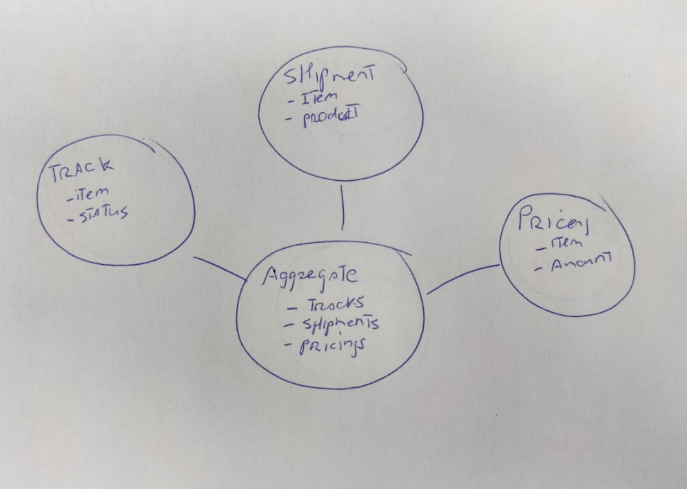

## Step 1) Figure out the domain:

## Step 2) Architecture

### Deployment

it should be easy to run the service. Therefore i use to run it as a Docker image.
Docker is widely used and can run anywhere from locally to somewhere in the cloud.

### Development platform/framework

I've a lot of experience with Spring-boot but this service is implemented using Quarkus.
Quarkus makes it easy for the developer to create cloud native images.
They spin up in no time, and the dev-mode makes it easy to implement functionality.
This is a great opportunity to get acquainted with this framework. 

### Build tooling

Maven compiles the code and delivers a deployable package or image.
Quarkus did help me here as well to get up and running in no time.

### Async communicatione

Async communication is a big part of this program.
In production applications I would choose Queue implementations like RabbitMQ.
Queueing makes it easy for applications to scale, but harder to test.
Because this is a demo application and scaling is less important than showing the programming skills I've chosen to do the queueing in memory.

Same is for the scheduling part. Scheduling is done in memory.
I would choose Quartz schedulers when running in the cloud with multiple instances.
This makes it possible to 'share' the scheduler and run the task once, and not once per instance.

## 3) Testing

I've chosen to test against running services.
This made the implementation easier to do because now I know it works with the real implementation.
Normally I would switch a connection service for a mock object, e.g.using Mockito, for my unit tests.
Now the unit test could be flaky because of failures from the connecting services, and it is impossible to test the failure situations.

This simple service I did not find it necessary to implement tests in a separate project with Cucumber for instance.
I like the Gherkin language to describe how the system should behave to create a common understanding of the system (stakeholdes/teammembers).
I found BDD very rewarding but also very time-consuming. That is why I do not use it in this application.

 